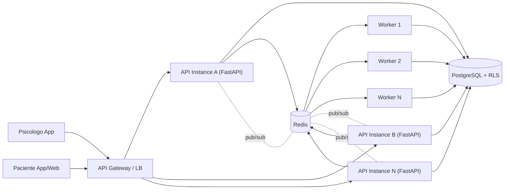

# Target Architecture

## 1) Objetivo
Arquitetura backend orientada a operacao comercial com:
- latencia previsivel sob carga mista,
- processamento assincrono para tarefas pesadas,
- entrega realtime horizontal (multi-instancia),
- isolamento multi-tenant com RLS,
- recuperacao controlada em falhas de worker/Redis/DB.

## 2) Arquitetura alvo (logica)

## 3) Caminhos criticos

### 3.1 Request/response (sincrono)
1. Cliente envia request autenticada.
2. API valida JWT e resolve `tenant_id`.
3. API abre sessao DB com `SET LOCAL ROLE cori_app` + `set_config(app.current_tenant_id)`.
4. Consulta/escrita executa sob policy RLS por tenant.
5. Resposta retorna ao cliente.

### 3.2 Notificacao + realtime (hibrido)
1. Evento de dominio persiste `notification_delivery` no Postgres.
2. API entrega local por WebSocket (canal tenant/patient).
3. API publica envelope no Redis pub/sub.
4. Demais instancias recebem do pub/sub e entregam aos seus sockets locais.
5. Campo `origin` evita entrega duplicada na instancia emissora.

### 3.3 Jobs/workers (assincrono)
1. Job entra em `ready` com `idempotency_key`.
2. Worker faz claim (`ready` -> `processing`).
3. Handler executa com contexto DB seguro.
4. Sucesso: `ack` remove de `processing`.
5. Falha: vai para `retry` com backoff exponencial.
6. Limite de tentativas: vai para `dead` (DLQ).

## 4) Controles de resiliencia
- Retry seguro com backoff exponencial (configuravel).
- Dead-letter queue para erro permanente.
- Recuperacao de `processing` abandonado ao subir worker.
- Circuit breaker no publish realtime para Redis indisponivel.
- Fallback de entrega realtime local em falha de pub/sub.
- Health endpoint com status de DB e Redis.

## 5) Controles de concorrencia e backpressure
- `worker_max_jobs_per_cycle`: limita jobs por ciclo.
- `worker_job_claim_timeout_seconds`: controla bloqueio de claim.
- `worker_job_max_attempts`: limita retries por job.
- Threshold de erro em stress test para degradacao controlada.

## 6) Observabilidade alvo
- Logs de worker por evento: `job_ack`, `job_failed`, queue depths, heartbeat.
- Artefatos versionados para baseline/load/stress/soak/realtime/falha.
- SLO/SLA com metas e erro-budget em documento dedicado.

## 7) Estrategia de deploy/rollout
1. Build de imagem API/worker.
2. Migração Alembic `upgrade head`.
3. Deploy canario de API (1 instancia) + validacao `/health`.
4. Escalonar API horizontalmente.
5. Escalonar workers por lag de fila e throughput.
6. Rollback: reduzir versao de API/worker e restaurar release anterior (migrations somente compatibilizadas).

## 8) Delta principal aplicado
- Realtime deixou de depender de estado local de instancia unica.
- Worker passou a operar sobre fila robusta com retry/backoff/DLQ/idempotencia.
- Falhas de worker/Redis/DB foram exercitadas com probes reprodutiveis e artefatos JSON.
